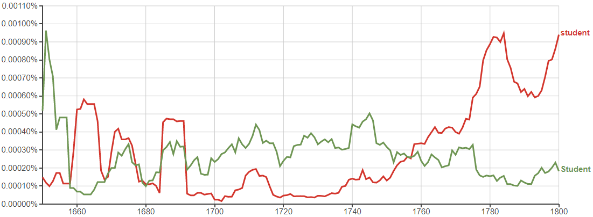
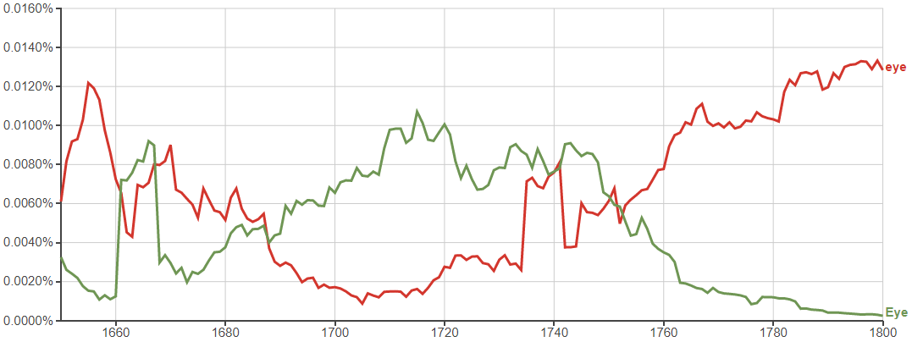
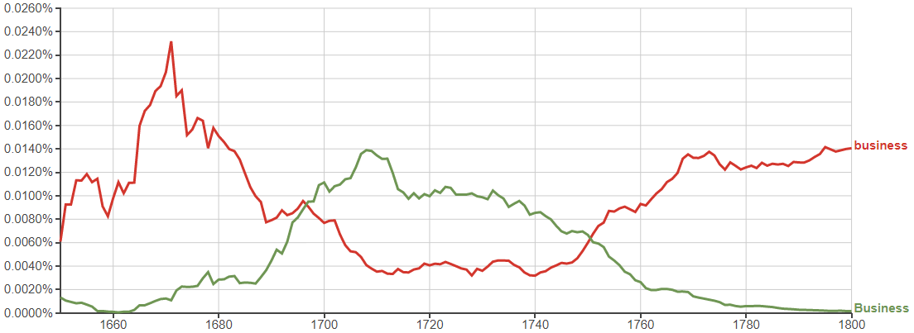

# The Great Capitalisation Shift(s)

[Google Ngram Viewer](https://books.google.com/ngrams) shows how __a grammar convention changed twice in under a century__.

Graphing frequency of common nouns in a huge corpus of English-language books, this feature is very common between late 17th centry and mid 18th century:

The difference being whether a common noun has its first letter capitalised.

## Contents
- [50 common nouns](#50-common-nouns)
- [What's going on?](#whats-going-on)
- [Why did it happen?](#why-did-it-happen)

# 50 common nouns
In an effort to show lack of bias, I have taken the top 50 nouns from [this list](https://www.espressoenglish.net/100-common-nouns-in-english/).

I may increase this number at some point, but only in the order as listed on that page.

### time

### year

### people

### way

### day

### man

### thing

### woman

### life

### child

### world

### school

### state

### family

### student

### group

### country

### problem

### hand

### part

### place

### case

### week

### company

### system

### program

### question

### work

### government

### number

### night

### point

### home

### water

### room

### mother

### area

### money

### story

### fact

### month

### lot

### right

### study

### book

### eye

### job

### word

### business

### issue

All graphs between 1650 and 1800 from the corpus English with smoothing of 3.

## What's going on?

During this time common nouns would often be capitalised. For example, I searched Google Books for "spectator" and limited my search to 1700-1740 inclusive.

> ...and applying it to his Lips, when we expected the last Word of his Sentence, put us off with a Whiff of Tobacco; which he redoubled with so much Rage and Trepidation, that he almost stifled the whole Company. After a short Pause, I owned that I thought the SPECTATOR had gone too far in writing so many Letters of my Lady Q--p--t--s's Name; but however, says I, he has made a little Amends for it in his next Sentence, where he leaves a blank Space without so much as a Consonant to direct us? I mean, says I, after those Words, The Fleet, that used to be the Terrour of the Ocean, should be Wind-bound for the sake of a ---; after which ensues a Chasm, that in my Opinion looks modest enough. Sir, says my Antagonist, you may know...

_[The Spectator, Volume 8, p.58](https://books.google.co.uk/books?id=hW8PAAAAQAAJ&printsec=frontcover&source=gbs_ge_summary_r&cad=0#v=onepage&q&f=false)_

## Why did it happen?

[Stack Exchange user __gpr__ cites _The Cambridge Encyclopedia of the English Language (David Crystal), p67_](https://english.stackexchange.com/a/10602):
> Hart recommended his readers to use a capital letter at the beginning of every sentence, proper name, and important common noun. By the 17th century, the practice had extended to titles (Sir, Lady), forms of address (Father, Mistris), and personified nouns (Nature). Emphasized words and phrases would also attract a capital. By the beginning of the 18th century, the influence of Continental books had caused this practice to be extended still further (e.g. to the names of the branches of knowledge), and it was not long before some writers began using a capital for any noun that they felt to be important. Books appeared in which all or most nouns were given an initial capital (as is done systematically in modern German) - perhaps for aesthetic reasons, or perhaps because printers were uncertain about which nouns to capitalize, and so capitalized them all.
> 
> The fashion was at its height in the later 17th century, and continued into the 18th. The manuscripts of Butler, Traherne, Swift, and Pope are full of initial capitals. However, the later 18th-century grammarians were not amused by this apparent lack of discipline in the written language. In their view, the proliferation of capitals was unnecessary, and causing the loss of a useful potential distinction. Their rules brought a dramatic reduction in the types of noun permitted to take a capital letter.

## No I mean why did you do this

idk